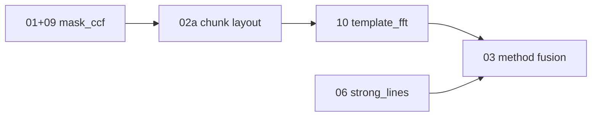

# Step 01: Benchmark cool high-S/N mask precision

## Goal / science outcome

Quantify APF **mask_ccf** per-epoch precision on cool, high-S/N calibration spectra and document gap to **<0.1 km/s** target. This step closes the **mask lane** of the per-method precision program; **template_fft** (step 10) and **strong_lines** (step 06) are separate lanes with their own tuning.

## Strategy: per-method lanes before fusion



Do **not** tune adopted-RV cascade (step 03) until each measurement path has its own baseline and deploy config.

## Scope (in) / non-goals (out)

**In:** Repeatability / chunk-scatter metrics on bias-training or overlap cool-star set; Phase A overlap gates; mask campaign north-star σ_RV.

**Out:** Template FFT tuning (step 10); trust weights (step 02b); method fusion (step 03).

## Prerequisites

- Calibration list (`calibration/bias_train.txt` or equivalent)
- Pipeline run with bias on, `--run-all-methods`
- Chunk campaign under `validation_output/chunk_campaign/` (114 exposures)

## Implementation tasks

### Core benchmark (step 01)

- [x] Define metric: per-exposure chunk scatter (initial); night-pair / jackknife deferred
- [x] `validation/benchmark_cool_precision.py` for cool-star high-S/N subset
- [x] Phase A: `validation/rv_phase_a_baseline.py` — overlap inventory, absolute (APF–lit) and relative (APF–APF) gates
- [x] Frozen baseline: `calibration/phase_a_baseline/` (goals.yaml, reference_manifest.json)
- [ ] Produce `validation_output/benchmark_cool_precision/` tables + plots (RMS vs log10 mask CCF S/N)
- [ ] Document 0.1 km/s goal interpretation (single epoch vs night-mean) in report README or playbook
- [ ] Record final mask-lane numbers in this file after `subchunks_8` deploy
- [ ] `--no-bias` pipeline rerun on overlap stars for canonical absolute gate

### Mask lane closure (extends 01 + 02a + 09)

- [x] Chunk campaign: uniform `subchunks_8` beats `subchunks_4` (~15% lower median σ_RV on 114-file cohort; adaptive mix ≈ pure s8)
- [x] CCF estimator: `gauss_offset` adopted (step 09)
- [x] Per-order heterogeneous mixes ruled out (greedy σ_norm mix worse than uniform layouts)
- [x] N ∈ {5,6,7,>8} not pursued — s8 sufficient on campaign
- [x] **Deploy defaults:** `DEFAULT_CHUNK_LAYOUT` → `subchunks_8.yaml`; refit scripts updated
- [x] `calibration/bias_train.txt` (114 campaign spectra)
- [x] `scripts/rebuild_mask_bias.sh` + `run_calibration_setup --chunk-layout`
- [ ] Run `bash scripts/rebuild_mask_bias.sh` → commit new `bias_statistics.txt`
- [ ] Refit production catalog (local + ziggy)

## Key files

- `validation/benchmark_cool_precision.py`, `validation/rv_phase_a_baseline.py`
- `validation/chunk_campaign.py`, `validation/chunk_adaptive_stack.py`
- `validation/chunk_optimization_advice.md`
- `validation/rv_method_diagnostics_report.py`, `validation/rv_method_overlap_report.py`
- `darkhunter_rv/pipeline.py`, `darkhunter_rv/ccf_rv_estimators.py`

## Commands

```bash
cd /Users/rfoley/darkhunter/rvs/dark-hunter_rv
CAMPAIGN=validation_output/chunk_campaign

# Cool-star internal benchmark
PYTHONPATH=. python3 -m validation.benchmark_cool_precision \
  --diagnostics-glob 'output/Gaia_DR3_*_diagnostics.csv' \
  --out-dir validation_output/benchmark_cool_precision

# Phase A gates (overlap inventory + APF–lit / APF–APF)
PYTHONPATH=. python3 -m validation.rv_phase_a_baseline \
  --output-dir output \
  --out-dir validation_output/rv_phase_a_baseline

# Mask lane campaign summary (post subchunks_8)
PYTHONPATH=. python3 -m validation.chunk_adaptive_stack --campaign-dir "$CAMPAIGN"
```

## Acceptance criteria

- Report identifies median/p90 chunk scatter for cool stars with `log10(median_mask_ccf_peak_snr) > 1.0`
- Explicit statement: met / not met / how far from 0.1 km/s goal
- Phase A overlap list + gate reports under `validation_output/rv_phase_a_baseline/`
- Mask lane deploy checklist complete (layout + bias + refit) **or** documented blocker
- Handoff note to step 10 (template baseline commands run on same diagnostics glob)

### Phase A baseline (2026-06-07, bias applied, subchunks_4 era)

| Metric | Value |
|--------|-------|
| Overlap stars (APF ∩ literature) | 8 |
| APF–literature pairs (7 d window) | 0 (min separation 189–971 d) |
| APF–APF pairs (7 d) | 14 across 4 stars |
| Relative gate median \|ΔRV\| | 0.30 km/s |
| Relative gate p90 \|ΔRV\| | 16.3 km/s (outliers: Gaia BH1, J1449+6919) |
| Stars with good relative precision | J2102+3703 (~0.009 km/s), J0824+5254 (~0.30 km/s) |

### Chunk campaign (2026-06, 114 exposures, production stack metric)

| Layout | Median σ_RV | Notes |
|--------|-------------|-------|
| **subchunks_8** | **0.0189 km/s** | Recommended production layout |
| subchunks_4 | 0.0223 km/s | Prior production |
| adaptive_mix | 0.0189 km/s | Collapses to s8 on 110/114 exposures |

**Caveat:** s8 improves per-epoch σ_RV but had worse APF–APF relative gate than s4 in campaign — review before binaries-heavy science.

## Tests / validation

- `tests/validation/test_benchmark_cool_precision.py`
- Chunk campaign tests: `test_chunk_adaptive_stack`, `test_per_order_chunk_baseline`, `test_spectrum_tiling_search`
- Step 09: `tests/test_ccf_rv_estimators.py`, `tests/validation/test_ccf_rv_post_debias.py`

## Propagation checklist (on merge)

- [ ] Master todo `benchmark-cool-precision` → completed when deploy + benchmark report land
- [ ] INDEX.md status + issue #38 closed
- [ ] Begin step 10 on fresh branch after mask deploy snapshot

## Open decisions

- **0.1 km/s:** track both single-epoch σ_RV and night-pair / APF–APF relative gate (precision framework Phase A).
- **Cool high-S/N cut:** `log10(median_mask_ccf_peak_snr) > 1.0` + mask-applicable Teff (`method_regions`).
- **Production layout:** uniform `subchunks_8` (not per-order greedy mix).

## Next step

**Step 10 — template FFT precision:** baseline mask−template overlap, then tune template-specific knobs. See [10-template-fft-precision.md](10-template-fft-precision.md).
